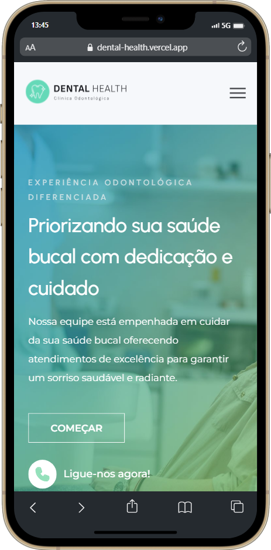
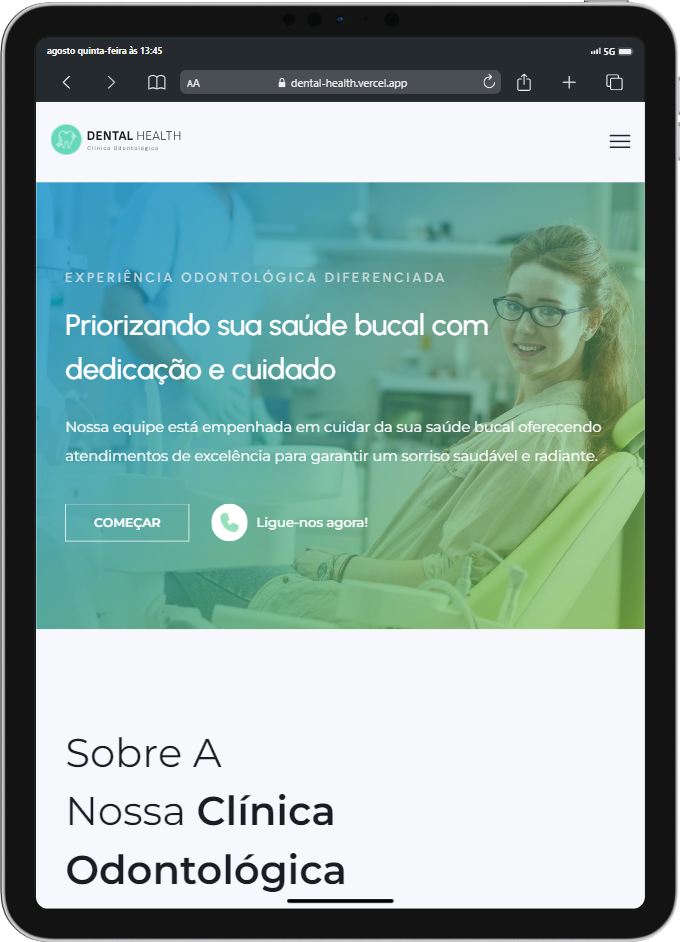

<h1 align="center">

</h1>
 

<h3 align="center">
🦷 Preview - Desktop
</h3>

 
 

<h3 align="center">
🦷 Preview - Mobile e Tablet
</h3>
 

&ensp; &ensp; &ensp; &ensp; &ensp; &ensp; &ensp; &ensp; &ensp; &ensp; &ensp; &ensp; &ensp; &ensp; &ensp;  &ensp; &ensp; &ensp; 
 
 

## 🦷 Sobre

> É um projeto de uma landing page para o portfólio da Inova Company, que é a empresa onde trabalho.
 

## 💮 Seções
O site é composto por cinco partes:

- **Home:** Nessa parte é uma breve apresentação da empresa.
- **Sobre nós:** Fala um pouco sobre a empresa.
- **Serviços:** Mostra os atendimentos prestados.
- **Depoimentos:** É onde fica o depoimento de clientes antigos.
- **Contato:** É uma seção de contato com formulário.
 

---

## 💻 Tecnologias utilizadas:

Para o desenvolvimento deste site utilizei as seguintes tecnologias:

* HTML
* Sass
* JavaScript
* ScrollReveal
* Figma

---

## 🎐 Licença
Esse projeto está sob licença. Clique no arquivo [LICENÇA](https://github.com/larisn/larisn/blob/main/LICENSE.md) para ver mais detalhes.

 

---

Feito com 💙 by larisn
